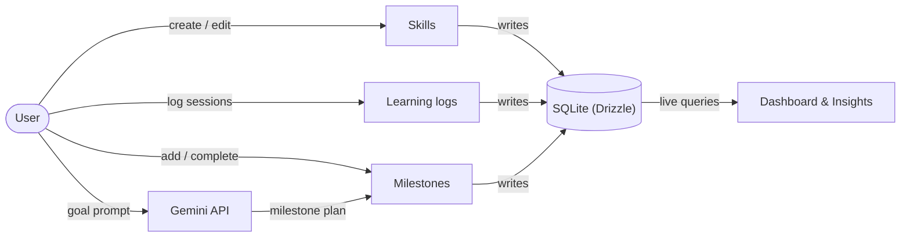
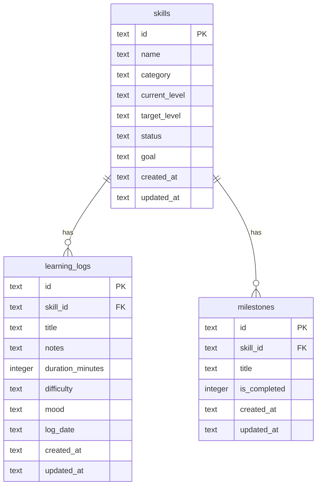

# SkillPulse

[](https://expo.dev)
[](https://reactnative.dev)
[](https://www.typescriptlang.org)


> An offline-first React Native app for tracking learning progress — skills, daily study logs, milestones, and weekly insights — with an optional AI learning-plan generator powered by Google Gemini.

Built with Expo (SDK 56), TypeScript, Expo Router, NativeWind, Drizzle ORM, Zustand, React Hook Form + Zod, and the Gemini API.

---

## Preview

| Home | Skills | Skill detail | Insights | AI plan |
|---|---|---|---|---|
| _todo_ | _todo_ | _todo_ | _todo_ | _todo_ |

**Demo video:** _todo_

---

## About

SkillPulse helps developers and lifelong learners track what they're learning, how
consistent they are, and how much progress they've made. Create skills, log daily
study sessions, break goals into milestones, and watch your streak and weekly
insights update in real time.

Everything is stored locally with on-device SQLite, so the app works fully offline —
no account, no backend. The one optional online feature is the AI learning-plan
generator, which turns a free-text goal into a milestone checklist using the Gemini API.

---

## Features

- **Skills** — create, edit, and delete skills with category, current/target level, status, and a personal goal. Filter by category.
- **Learning logs** — log daily sessions (title, duration, difficulty, mood, notes, date) and see total learning hours, filtered by skill.
- **Milestones** — break each skill into a checklist; tick items off and watch the progress bar fill.
- **Dashboard** — current streak, total hours, active skills, milestones completed, most-practiced skill, and this-week time.
- **Insights** — a Mon–Sun weekly bar chart, headline stats, and a skills-by-category breakdown.
- **AI learning plan** — describe a goal (e.g. *"Learn React Native in 30 days"*) and Gemini drafts a milestone plan you can save straight onto a skill.
- **Offline-first** — all data lives in on-device SQLite via Drizzle ORM, with reactive live queries so the UI updates instantly on every change.

---

## Tech Stack

| Tool | Purpose |
|---|---|
| React Native + Expo (SDK 56) | Cross-platform mobile app |
| TypeScript | Type safety (strict mode) |
| Expo Router | File-based navigation (tabs + stack) |
| NativeWind v4 | Tailwind-style styling |
| Drizzle ORM + Expo SQLite | Type-safe, offline local database |
| Zustand | UI state |
| React Hook Form + Zod | Forms and validation |
| Google Gemini API | AI learning-plan generation |
| Bun | Package manager / scripts |

---

## System Flow

SQLite is the single source of truth. Screens write through a typed query layer and
read through reactive live queries, so any change re-renders the affected views
automatically. Zustand holds UI state only.



**Typical journey:** create a skill → add milestones and log sessions → the dashboard,
streak, and weekly insights update live → optionally generate an AI plan and save it as
milestones.

---

## Database Overview

Three tables in on-device SQLite. Learning logs and milestones belong to a skill and
cascade-delete with it. TypeScript types are derived directly from the Drizzle schema,
so the schema is the single source of truth. Migrations are generated with `drizzle-kit`
and applied on first launch.



---

## API Endpoints

SkillPulse has **no custom backend** — all persistence is local SQLite, accessed
through typed Drizzle query functions in `src/db/queries/` (not network endpoints).

The only external call is to the **Google Gemini API** for the AI learning plan
(`src/lib/ai.ts`):

| Method | Endpoint | Purpose |
|---|---|---|
| `POST` | `https://generativelanguage.googleapis.com/v1beta/interactions` | Generate a learning plan |

- **Auth:** `x-goog-api-key` header (`EXPO_PUBLIC_GEMINI_API_KEY`)
- **Model:** `gemini-3.5-flash`
- **Request:** a free-text goal with `response_format` requesting a JSON array of strings (structured output)
- **Response:** the plan text is read from `steps[].content[].text` of the returned interaction, then parsed into milestone titles

---

## Getting Started

### Prerequisites

- [Bun](https://bun.sh)
- [Xcode](https://developer.apple.com/xcode/) (iOS Simulator) and/or [Android Studio](https://developer.android.com/studio)
- The [Expo Go](https://expo.dev/go) app, or a simulator/emulator

### Install

```bash
bun install
```

### Environment variables

The AI feature needs a Google Gemini API key (free tier works). Get one at
[aistudio.google.com/apikey](https://aistudio.google.com/apikey).

```bash
cp .env.example .env
# then edit .env and set your key
```

```env
EXPO_PUBLIC_GEMINI_API_KEY=your_gemini_api_key_here
```

> `.env` is gitignored. The key is bundled into the client (`EXPO_PUBLIC_`), which is fine for a local/demo build but not for production. Everything except the AI screen works without a key.

### Run

```bash
bun run ios       # iOS Simulator
bun run android   # Android emulator
bun run start     # Metro — then press i / a / w
```

The database and its tables are created automatically on first launch (Drizzle migrations run via `useMigrations`).

### Scripts

| Script | Description |
|---|---|
| `bun run start` | Start the Metro bundler |
| `bun run ios` / `android` / `web` | Launch on a target platform |
| `bun run db:generate` | Generate a new Drizzle migration after editing the schema |
| `bun run lint` | Run ESLint |

---

## What I Learned

- Wiring **Drizzle ORM** to Expo SQLite with on-device migrations and reactive
  `useLiveQuery` reads.
- A clean separation between **SQLite as the source of truth** and Zustand for UI
  state only.
- Building forms with **React Hook Form + Zod** sharing a single schema for
  validation and types.
- Integrating a third-party **LLM API** (Gemini) with structured JSON output,
  and debugging an undocumented response shape against the live API.

---

## Future Improvements

- [ ] Dark mode
- [ ] Push-notification reminders
- [ ] Data export (CSV / PDF)
- [ ] Cloud sync + authentication
- [ ] Automated tests (jest-expo) for the streak/insights helpers

---

## License

[MIT](./LICENSE)
